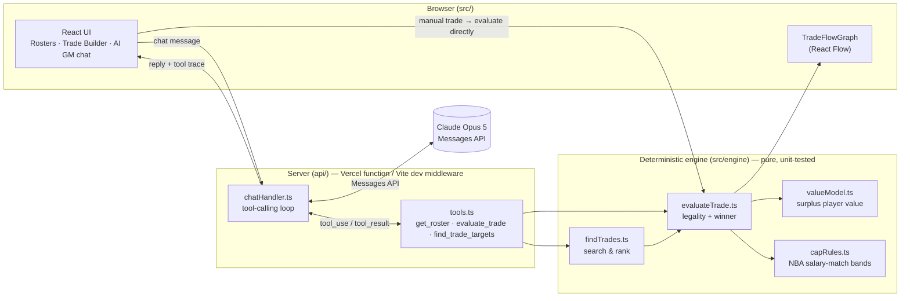

# AI GM Trade Desk

A web tool for constructing and auto-finding salary-cap-legal NBA trades. An LLM
orchestrates deterministic valuation and constraint tools; a React Flow view
visualizes proposed trades as a graph of teams and players.

Stack: Vite + React + TypeScript, LLM tool-calling, React Flow.

## Status

Day 6: hardened edge cases (can't select the same team on both sides of a
trade, typed API error messages for auth/rate-limit/network failures,
Claude refusals and empty replies handled gracefully) and wrote up the
architecture below. Day 5 added a React Flow trade visualizer — the
manual Trade Builder renders every proposed trade as a graph (teams and
players as nodes, edges showing who moves where), color-coded green/red
by cap legality. The trade finder (Day 4) lets you describe a need in
plain English ("I need a starting PG, I can give up wings") instead of
naming a specific player; the agent searches every other team's roster
for legal, ranked packages. The LLM never computes cap legality or value
itself — it only calls `get_roster` / `evaluate_trade` /
`find_trade_targets` and explains the results.

## Development

```bash
npm install
cp .env.example .env.local   # add your ANTHROPIC_API_KEY
npm run dev
```

`npm run dev` also serves `/api/chat` locally via a Vite dev-server
middleware, so the AI GM tab works without deploying. In production
(Vercel), the same logic runs as the `api/chat.ts` serverless function —
the API key never reaches the browser.

```bash
npm test    # vitest — engine, tools, and chat-handler unit tests
npm run lint
```

## Architecture

The core design decision: **the LLM never computes a number.** Cap legality
and trade value are deterministic TypeScript, unit-tested independently of
any model call. The LLM's job is orchestration (deciding which tool to call
for a given request) and explanation (turning a JSON tool result into
basketball language) — never arithmetic.



**Layers, inside out:**

- **`src/engine/`** — pure functions, no I/O, no framework dependency. `playerValue` models surplus value (market value vs. actual salary, discounted per remaining contract year, adjusted for age); `checkSalaryMatch` implements the real NBA salary-matching bands by apron status; `evaluateTrade` combines both for a specific proposed trade; `findTrades` runs the combinatorial search behind the trade finder. Fully covered by `vitest` — these are the functions a resume bullet points at.
- **`api/_lib/tools.ts`** — wraps the engine as three LLM tool definitions + executors. This is the only place that translates between "player ids the model reasons about" and "Player objects the engine operates on."
- **`api/_lib/chatHandler.ts`** — the agentic loop: call Claude with the tools, execute whatever it requests locally, feed results back, repeat until it has a final answer (capped at 6 iterations). Runs identically in two places — `api/chat.ts` (Vercel serverless function in production) and a Vite dev-server middleware (`vite.config.ts`) for local development — so the Anthropic API key is never sent to the browser in either environment.
- **`src/components/`** — the React UI. The Trade Builder calls `evaluateTrade` directly (no LLM needed for a fully-specified trade); the AI GM chat talks to `/api/chat`; `TradeFlowGraph` renders any evaluated trade as a graph regardless of which path produced it.

## Roadmap

- Day 2: deterministic player value model + cap-match validator (`evaluate_trade`) — done
- Day 3: LLM tool-calling loop (trade evaluation + explanation) — done
- Day 4: trade finder — search + rank legal packages from a plain-English request — done
- Day 5: React Flow trade visualizer — done
- Day 6: error handling, edge cases, architecture docs — done
- Day 7: final deploy + demo
