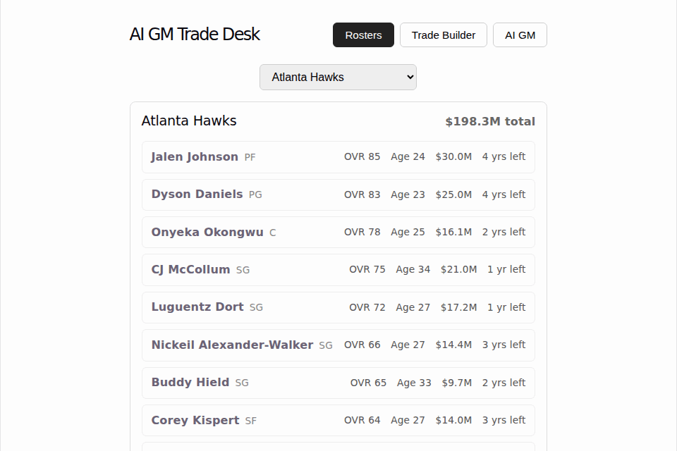
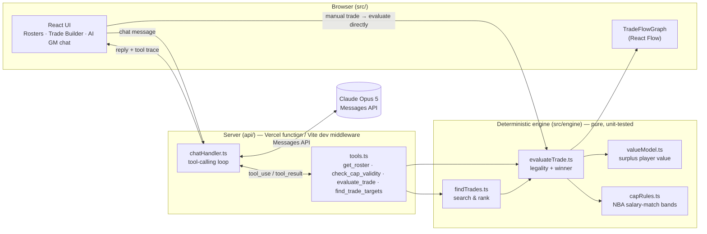

# AI GM Trade Desk

A web tool for constructing and auto-finding salary-cap-legal NBA trades. An LLM
orchestrates deterministic valuation and constraint tools; a React Flow view
visualizes proposed trades as a graph of teams and players.

Stack: Vite + React + TypeScript, LLM tool-calling, React Flow.

## Demo



Rosters → Trade Builder (checks a trade against real 2026-27 cap rules,
renders it as a graph) → the AI GM tab. This environment has no
`ANTHROPIC_API_KEY`, so neither recording shows a live model call: the
GIF above mocks the `/api/chat` response to show what a
`find_trade_targets` result looks like rendered as a `TradeFlowGraph`
(clearly a stand-in, not a real exchange); the higher-quality
[`docs/demo.webm`](docs/demo.webm) stops before submitting rather than
show a fake response. Worth re-recording both once deployed with a real
key, so the AI GM segment is an actual model response.

## Status

Running on the real 2026-27 NBA season — 529 players across all 30 teams,
real salaries and contract lengths, real salary cap/apron figures. Day 6
hardened edge cases (can't select the same team on both sides of a trade,
typed API error messages for auth/rate-limit/network failures, Claude
refusals and empty replies handled gracefully) and wrote up the
architecture below. Day 5 added a React Flow trade visualizer — the
manual Trade Builder renders every proposed trade as a graph (teams and
players as nodes, edges showing who moves where), color-coded green/red
by cap legality. The trade finder (Day 4) lets you describe a need in
plain English ("I need a starting PG, I can give up wings") instead of
naming a specific player; the agent searches every other team's roster
for legal, ranked packages. The LLM never computes cap legality or value
itself — it only calls `get_roster` / `check_cap_validity` /
`evaluate_trade` / `find_trade_targets` and explains the results.
`find_trade_targets` results render as `TradeFlowGraph`s directly in the
chat, not just text.

## Data

`src/data/players.ts` is real, not a fixture — 529 players, all 30 teams,
researched from Wikipedia's per-team "2026-27 season" roster pages
(position, birth date) and HoopsHype's season salary tables (2026-27
salary, contract length). League-wide cap figures in
`src/engine/constants.ts` are the NBA's official 2026-27 numbers.

Two things worth knowing:

- **`overall` is computed from real 2025-26 per-game stats** (points,
  rebounds, assists, steals, blocks, shooting splits — the most recently
  completed season), via a documented formula in
  [`scripts/compute-overall-ratings.mjs`](scripts/compute-overall-ratings.mjs),
  not hand-assigned. It's still not an official stat — no such thing
  exists — but it's reproducible and traceable to real numbers rather
  than a judgment call. The one exception: players with fewer than 15
  games played in 2025-26 (rookies, draft-and-stash, injury-shortened
  seasons) have no real sample to compute from, so they keep a
  subjective tier estimate instead — a documented, bounded minority of
  the 529. The formula itself is intentionally simple (a demo
  methodology, not a scouting model) and has known biases — e.g. it can
  overvalue low-volume, high-efficiency bigs relative to high-usage
  wings having an off shooting year.
- **A handful of players have estimated salaries** where a contract was
  still unresolved as of the data pull (restricted free agents,
  unsigned draft picks) or the player wasn't in the salary source at all
  (deep two-way/exhibit-10 players). These are a small minority of the
  529 and don't affect the demo's behavior, but if you're citing a
  specific number, spot-check it.

## Development

```bash
npm install
cp .env.example .env.local   # add your ANTHROPIC_API_KEY
npm run dev
```

`npm run dev` also serves `/api/chat` locally via a Vite dev-server
middleware, so the AI GM tab works without deploying. In production
(Vercel), the same logic runs as the `api/chat.ts` serverless function —
the API key never reaches the browser.

```bash
npm test    # vitest — engine, tools, and chat-handler unit tests
npm run lint
```

## Architecture

The core design decision: **the LLM never computes a number.** Cap legality
and trade value are deterministic TypeScript, unit-tested independently of
any model call. The LLM's job is orchestration (deciding which tool to call
for a given request) and explanation (turning a JSON tool result into
basketball language) — never arithmetic.



**Layers, inside out:**

- **`src/engine/`** — pure functions, no I/O, no framework dependency. `playerValue` models surplus value (market value vs. actual salary, discounted per remaining contract year, adjusted for age); `checkSalaryMatch` implements the real NBA salary-matching bands by apron status; `evaluateTrade` combines both for a specific proposed trade; `findTrades` runs the combinatorial search behind the trade finder. Fully covered by `vitest` — these are the functions a resume bullet points at.
- **`api/_lib/tools.ts`** — wraps the engine as four LLM tool definitions + executors (`get_roster`, `check_cap_validity`, `evaluate_trade`, `find_trade_targets`). This is the only place that translates between "player ids the model reasons about" and "Player objects the engine operates on." `check_cap_validity` and `evaluate_trade` both run the same underlying `checkSalaryMatch` — the former for a single team's isolated cap math, the latter for a full two-sided trade plus value.
- **`src/lib/visualizeToolCall.ts`** — re-derives graph-ready data (full `Team`/`Player` objects, a complete `TradeEvaluation`) from a tool call's own input by re-running the same deterministic engine client-side, so `evaluate_trade` and `find_trade_targets` results render as `TradeFlowGraph`s in the chat, not just JSON.
- **`api/_lib/chatHandler.ts`** — the agentic loop: call Claude with the tools, execute whatever it requests locally, feed results back, repeat until it has a final answer (capped at 6 iterations). Runs identically in two places — `api/chat.ts` (Vercel serverless function in production) and a Vite dev-server middleware (`vite.config.ts`) for local development — so the Anthropic API key is never sent to the browser in either environment.
- **`src/components/`** — the React UI. The Trade Builder calls `evaluateTrade` directly (no LLM needed for a fully-specified trade); the AI GM chat talks to `/api/chat`; `TradeFlowGraph` renders any evaluated trade as a graph regardless of which path produced it.

## Roadmap

- Day 2: deterministic player value model + cap-match validator (`evaluate_trade`) — done
- Day 3: LLM tool-calling loop (trade evaluation + explanation) — done
- Day 4: trade finder — search + rank legal packages from a plain-English request — done
- Day 5: React Flow trade visualizer — done
- Day 6: error handling, edge cases, architecture docs — done
- Day 7: real 2026-27 league data (529 players, 30 teams), demo recording — done; production deploy is a one-time manual step (see below)

## Deploying

This repo is ready to deploy as-is — `vercel.json` already sets the API
route's timeout, and the build is a standard Vite app plus one
serverless function. From [vercel.com/new](https://vercel.com/new):

1. Import `skicactus/NBATrade`, branch `claude/ai-gm-trade-desk-day1-y9lzbc` (or `main` once merged).
2. Leave the framework preset on auto-detected Vite — no build settings to change.
3. In the project's **Environment Variables**, add `ANTHROPIC_API_KEY` with your key.
4. Deploy. Every subsequent push to the branch redeploys automatically.

I don't have Vercel credentials in this environment, so this step needs
you.
